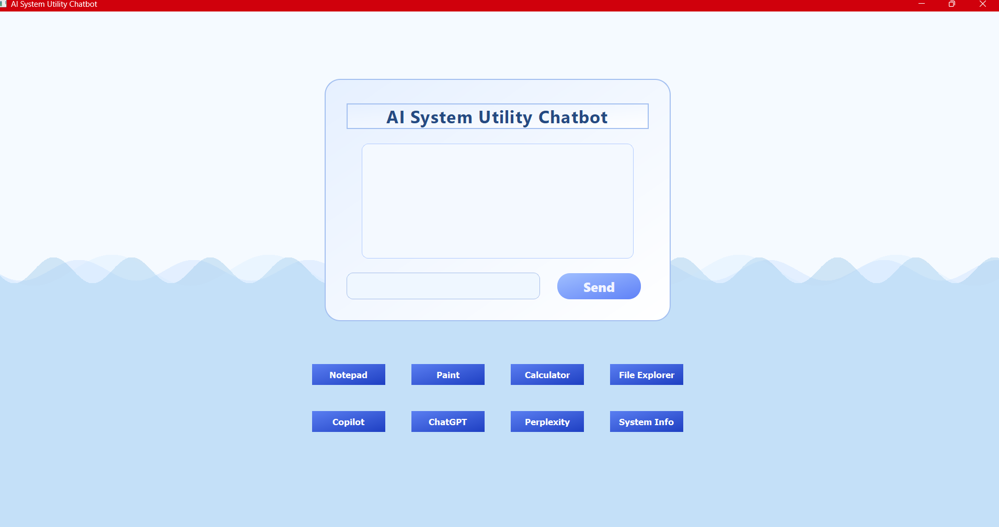
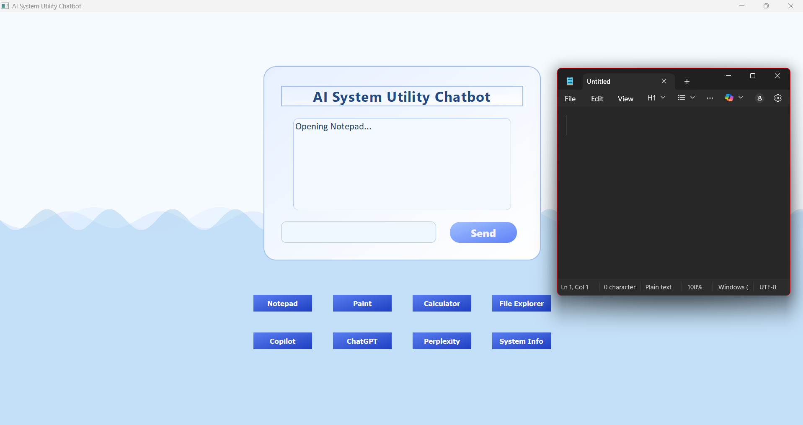
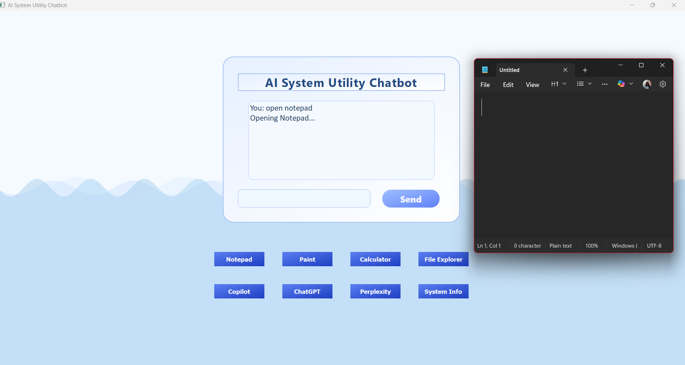
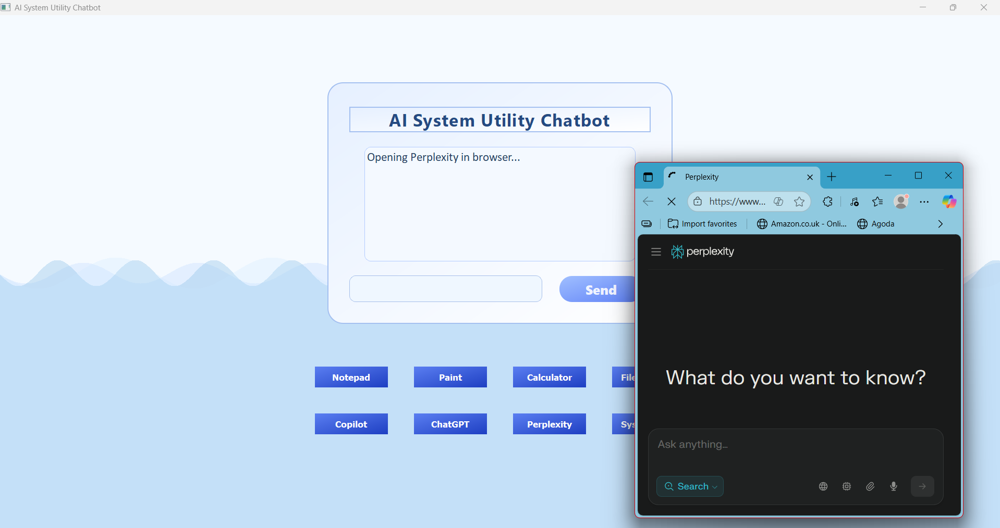
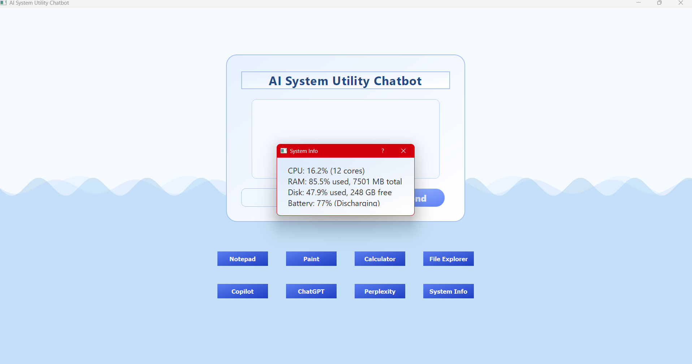

# AI System Utility Chatbot 🖥️🤖

A modern desktop-based AI utility assistant built using **Python** and **PyQt5**, providing a friendly chat-style interface for performing daily system tasks easily and quickly. 
The app can launch Windows utilities, open AI tools like ChatGPT & Perplexity, and show system information — all with button clicks or text commands.

---

## ✨ Features

- 🗨️ **Chat-style Command Interface**
  - Type commands like `open notepad`, `open perplexity`, `system info`, etc.
  - Automatic responses and status messages

- 🖱️ **Quick Action Buttons**
  - Notepad  
  - Paint  
  - Calculator  
  - File Explorer  
  - Copilot  
  - ChatGPT  
  - Perplexity  
  - System Info

- 📊 **Real-Time System Monitoring**
  - CPU usage / Cores
  - RAM usage
  - Disk usage
  - Battery percentage & charging status

- 🎨 **Modern UI Design**
  - Animated wave background
  - Gradient 3D buttons
  - Minimal, clean layout

---

## 🛠 Tech Stack

| Component | Technology |
|----------|------------|
| Language | Python 3.8+ |
| GUI Framework | PyQt5 |
| System Access | psutil |
| Platform | Windows 10 / 11 |

---

## 🧾 Requirements

Install dependencies:

```bash
pip install PyQt5 psutil
```

or use the requirements file:
```bash
pip install -r requirements.txt
```
---

## 🚀 How to Run the App

```bash
git clone https://github.com/ananya-sudo-pixel/AI-System-Utility-ChatBot.git
cd AI-System-Utility-ChatBot
pip install -r requirements.txt
python app.py
```

The chatbot opens as a desktop application window, not in a browser.

---

## 📸 Screenshots

### 🔹 Main UI


### 🔹 Notepad Button


### 🔹 Notepad via Command


### 🔹 Perplexity Button


### 🔹 Perplexity via Command


### 🔹 System Info Popup



---

## 💡 What the Bot Can Do

| Command              | Action                       |
| -------------------- | ---------------------------- |
| `open notepad`       | Launch Notepad               |
| `open paint`         | Open Paint                   |
| `open file explorer` | Opens file explorer          |
| `open perplexity`    | Launch browser to Perplexity |
| `system info`        | Show performance info        |
| `exit`               | Close the app                |

---
## 🔭 Future Improvements

Add voice commands

Add NLP for smarter text responses

Dark & light theme toggle

Add plugin system for more utilities

---

## 🎓 Academic Use

This project was developed as a Mini Project for practical learning in Computer Science.
Useful for academic submissions, resume portfolios, and Python GUI learning.

---
## 💜 Author

Pesala Ananya
Python Developer & UI Enthusiast

---

